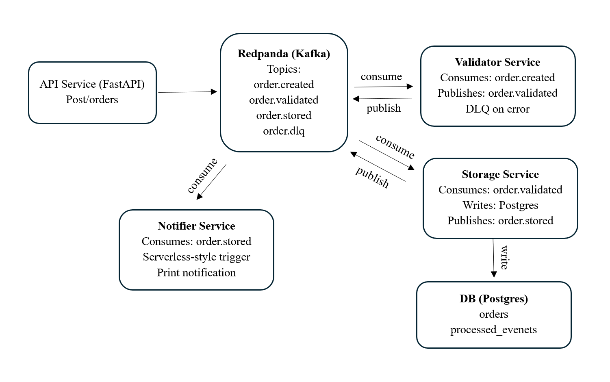
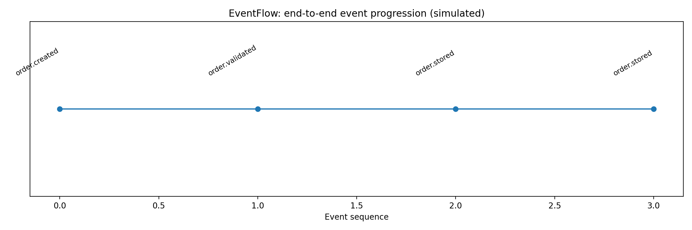
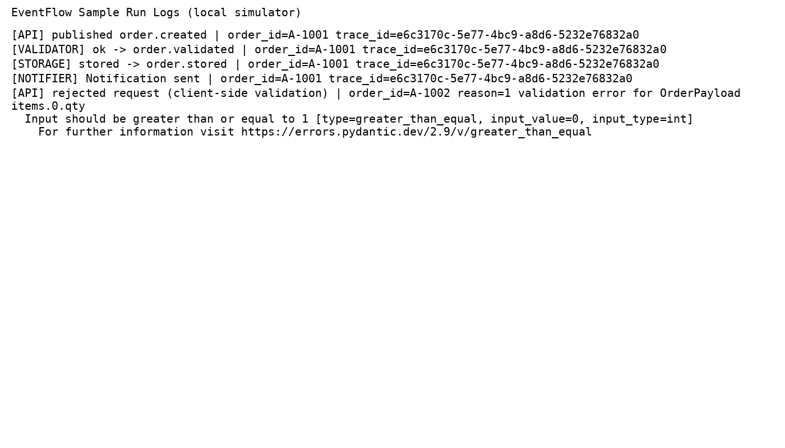

# EventFlow Microservices

EventFlow is a compact, production-style backend architecture demo for an asynchronous order-processing system. The project demonstrates how independent services can communicate through events instead of direct service-to-service calls.

The goal of this project is to show practical understanding of **microservices**, **event-driven architecture**, **Kafka/Redpanda messaging**, **DLQ handling**, **idempotent consumers**, **Docker-based orchestration**, and **serverless-style event processing**.

## Architecture Focus

This project is designed around cloud-native backend architecture patterns:

- **Microservice decomposition**: API, validation, storage, and notification are implemented as separate services.
- **Event-driven communication**: services communicate asynchronously through Kafka-compatible Redpanda topics.
- **Loose coupling**: each service only depends on the event contract, not on direct calls to other services.
- **Dead-letter queue handling**: failed validation or storage events are routed to `order.dlq` with error details.
- **Idempotent consumers**: the storage service tracks processed event IDs to avoid duplicate processing.
- **Traceability**: each event carries a `trace_id` so the same order can be followed across services.
- **Structured logging**: services emit JSON-style logs for easier debugging and observability.
- **Serverless-style processing**: the notifier service behaves like an event-triggered function, with an optional AWS SAM/Lambda stub.

## System Architecture

<p align="center">
  
</p>

The system follows an asynchronous event-driven architecture. Each service owns a specific responsibility and communicates through Kafka-compatible Redpanda topics.

### Event Flow

1. The client sends an order request to the FastAPI API service.
2. The API service validates the request and publishes an `order.created` event.
3. The Validator Service consumes `order.created`, performs business validation, and publishes `order.validated`.
4. The Storage Service consumes `order.validated`, stores the order in PostgreSQL, and publishes `order.stored`.
5. The Notifier Service consumes `order.stored` and sends/logs the final notification.
6. Invalid or failed events are routed to the dead-letter queue topic `order.dlq`.

Invalid or failed events are published to:

```text
order.dlq
```

## Services

| Service | Technology | Responsibility |
|---|---|---|
| `api-service` | FastAPI | Receives `POST /orders`, validates request shape, and publishes `order.created`. |
| `validator-service` | Python Kafka consumer | Consumes `order.created`, applies validation rules, and publishes `order.validated` or `order.dlq`. |
| `storage-service` | Python, SQLAlchemy, PostgreSQL | Consumes `order.validated`, stores orders, prevents duplicate event processing, and publishes `order.stored`. |
| `notifier-service` | Python Kafka consumer | Consumes `order.stored` and performs notification-style processing. |
| `redpanda` | Kafka-compatible broker | Provides topic-based asynchronous messaging. |
| `postgres` | PostgreSQL | Stores orders and processed event IDs. |
| `kafka-ui` | Kafka UI | Optional browser interface for viewing topics and messages. |

## Event Topics

| Topic | Producer | Consumer | Purpose |
|---|---|---|---|
| `order.created` | `api-service` | `validator-service` | New order accepted by the API. |
| `order.validated` | `validator-service` | `storage-service` | Order passed validation and is ready to persist. |
| `order.stored` | `storage-service` | `notifier-service` | Order was stored successfully. |
| `order.dlq` | `validator-service`, `storage-service` | DLQ review/debugging | Failed events with error details. |

Event schemas are documented in [`docs/events.md`](docs/events.md).

## Reliability Patterns Included

### Dead-letter queue

If validation or storage fails, the event is not silently dropped. It is wrapped with error information and published to `order.dlq`.

### Idempotent storage consumer

The storage service keeps a `processed_events` table. Before processing an event, it checks whether the `event_id` has already been handled. This prevents duplicate writes when a message is redelivered.

### Manual offset commits

Kafka consumers use manual commits. A message is committed only after the service finishes the required processing step.

### Trace IDs

Each event includes a `trace_id`. This makes it easier to follow the same order through API, validation, storage, and notification logs.

## Cloud Architecture Mapping

The project runs locally with Docker Compose, but the architecture maps naturally to common cloud services.

| Local Component | Possible AWS Equivalent | Possible Azure/GCP Equivalent |
|---|---|---|
| FastAPI API service | API Gateway + ECS/Fargate or Lambda | Azure Container Apps, App Service, Cloud Run |
| Redpanda/Kafka | Amazon MSK, SNS/SQS, or EventBridge | Azure Event Hubs, Service Bus, Pub/Sub |
| PostgreSQL | Amazon RDS PostgreSQL | Azure Database for PostgreSQL, Cloud SQL |
| Notifier service | AWS Lambda | Azure Functions, Cloud Functions |
| Docker Compose | ECS, EKS, or Kubernetes | AKS, GKE, Cloud Run services |
| Structured logs | CloudWatch Logs | Azure Monitor, Google Cloud Logging |

This makes the project useful as a local demonstration of cloud-native patterns before moving to managed cloud infrastructure.

## Project Structure

```text
Eventflow-Microservices-main/
├── docker-compose.yml
├── Makefile
├── README.md
├── docs/
│   ├── architecture_v2.png
│   ├── events.md
│   ├── event_timeline.png
│   └── sample_run_logs.png
├── demo/
│   ├── simulate_run.py
│   └── requirements.txt
├── serverless/
│   └── notifier-lambda/
│       ├── handler.py
│       └── template.yaml
└── services/
    ├── api-service/
    ├── validator-service/
    ├── storage-service/
    ├── notifier-service/
    └── common/
```

## Quick Start with Docker

### 1. Start all services

```bash
docker compose up --build
```

### 2. Create an order

```bash
curl -X POST http://localhost:8000/orders \
  -H "Content-Type: application/json" \
  -d '{"order_id":"A-1001","customer_id":"C-42","items":[{"sku":"SKU-1","qty":2},{"sku":"SKU-2","qty":1}]}'
```

Expected API response:

```json
{
  "accepted": true,
  "event_id": "...",
  "trace_id": "...",
  "topic": "order.created"
}
```

### 3. Watch the pipeline

In the Docker Compose logs, the order should move through the pipeline:

```text
api-service        -> publishes order.created
validator-service  -> publishes order.validated
storage-service    -> writes to PostgreSQL and publishes order.stored
notifier-service   -> logs notification sent
```

### 4. Open Kafka UI

```text
http://localhost:8080
```

Kafka UI can be used to inspect topics such as `order.created`, `order.validated`, `order.stored`, and `order.dlq`.

## Local Simulator Without Docker

A lightweight simulator is included for quick demonstration without Docker, Redpanda, or PostgreSQL.

```bash
python demo/simulate_run.py
```

The simulator uses an in-memory event bus and SQLite while preserving the same high-level event flow.

It creates:

```text
demo/output/orders.db
demo/output/event_timeline.png
demo/output/sample_run_logs.png
```

## Demo Outputs

### Event timeline

<p align="center">
  
</p>

### Sample logs

<p align="center">
  
</p>

## API Endpoint

### `POST /orders`

Creates an order request and publishes an `order.created` event.

Example request body:

```json
{
  "order_id": "A-1001",
  "customer_id": "C-42",
  "items": [
    {"sku": "SKU-1", "qty": 2},
    {"sku": "SKU-2", "qty": 1}
  ]
}
```

### `GET /health`

Returns a simple health check response from the API service.

```json
{
  "status": "ok"
}
```

## Serverless Stub

The `serverless/notifier-lambda` folder contains a minimal AWS SAM/Lambda-style notifier stub. It is included to show how the notification step could be moved from a long-running consumer to an event-triggered serverless function.

This is a reference implementation only. A full cloud deployment would require real AWS resources such as MSK/EventBridge/SQS, IAM permissions, deployment parameters, and monitoring.

## What This Project Demonstrates

This project is useful for discussing:

- How microservices communicate asynchronously
- Why event-driven systems reduce direct service coupling
- How Kafka topics support staged processing
- How DLQs help handle invalid or failed events
- Why idempotency matters in event consumers
- How trace IDs improve observability
- How a local Docker Compose system can map to managed cloud services
- How serverless functions can fit into an event-driven workflow

## Current Limitations and Possible Upgrades

This project is intentionally small. The next practical upgrades would be:

- Add automated tests for API, validation, storage, and event schemas
- Add retry/backoff handling around service-level failures
- Add a DLQ replay or inspection utility
- Add OpenTelemetry tracing or Prometheus/Grafana monitoring
- Add GitHub Actions for linting and tests
- Add a cloud deployment guide using AWS, Azure, or GCP
- Add infrastructure-as-code using Terraform, AWS SAM, or CDK
- Add authentication and request-level security for the API

## Notes

- Redpanda is Kafka-compatible, so standard Kafka libraries can be used.
- The API returns `202 Accepted` because order processing continues asynchronously after the initial request.
- The storage service uses idempotency to reduce duplicate-processing risk.
- The notifier service is intentionally simple to keep the event-driven flow easy to understand.
