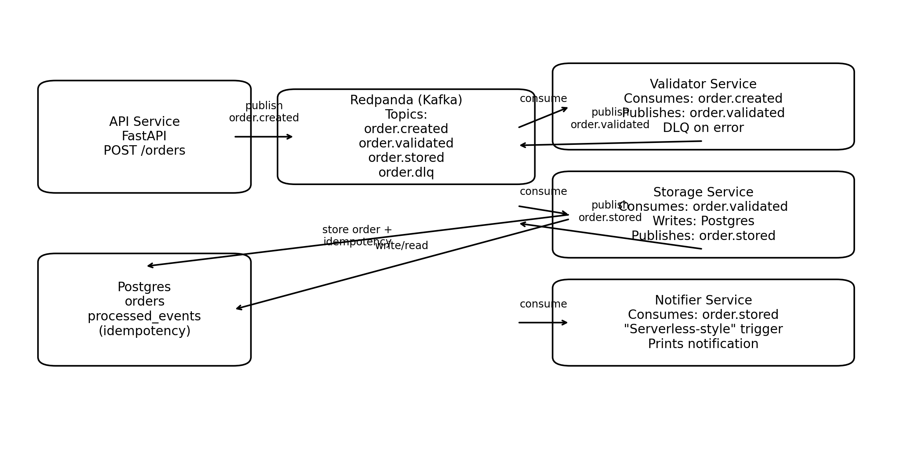

# EventFlow: Microservices + Event-Driven + “Serverless-style” Notifications (Local)

EventFlow is a small, production-style demo that shows:

- **Microservices**: separate services for API ingestion, validation, persistence, and notifications.
- **Event-driven architecture**: services communicate via Kafka topics (Redpanda).
- **Serverless computing (demo)**: a notification worker behaves like a Lambda-style function triggered by events (and includes an optional AWS SAM stub).
- **Cloud architecture patterns**: idempotent consumers, retry + DLQ, health checks, structured logs.

## Architecture



## Services

- `api-service` (FastAPI): receives `POST /orders` and publishes `order.created`.
- `validator-service`: consumes `order.created`, validates, publishes `order.validated` (or DLQ).
- `storage-service`: consumes `order.validated`, writes to Postgres, publishes `order.stored` (or DLQ).
- `notifier-service`: consumes `order.stored` and prints a notification (serverless-style trigger).
- `kafka-ui` (optional): browse topics in the browser.

## Event Topics

- `order.created`
- `order.validated`
- `order.stored`
- `order.dlq` (dead-letter queue)

Event schemas are documented in [`docs/events.md`](docs/events.md).

## Quick start (Docker)

### 1) Start everything
```bash
docker compose up --build
```

### 2) Create an order
```bash
curl -X POST http://localhost:8000/orders \
  -H "Content-Type: application/json" \
  -d '{"order_id":"A-1001","customer_id":"C-42","items":[{"sku":"SKU-1","qty":2},{"sku":"SKU-2","qty":1}]}'
```

### 3) Watch the pipeline
In the `docker compose` logs, you should see:
- API publishes `order.created`
- Validator publishes `order.validated`
- Storage writes to Postgres and publishes `order.stored`
- Notifier prints “notification sent”

## Proof it works (included images)

These images are included in `docs/`:

- **Event timeline plot**: `docs/event_timeline.png`
- **Sample run log screenshot**: `docs/sample_run_logs.png`

They were generated by running the included local simulator (`demo/simulate_run.py`) which uses the **same event models** and **same validation/storage logic** but with an in-memory event bus (so it runs anywhere without Docker).

## Local simulator (no Docker)
```bash
python demo/simulate_run.py
```
It will create:
- `demo/output/orders.db` (SQLite)
- `demo/output/event_timeline.png`
- `demo/output/sample_run_logs.png`

## Notes
- Redpanda is Kafka-compatible, so standard Kafka libraries work.
- Each consumer is **idempotent** using `(event_id)` de-duplication.
- Failed messages are sent to `order.dlq` with error details.

## License
MIT
